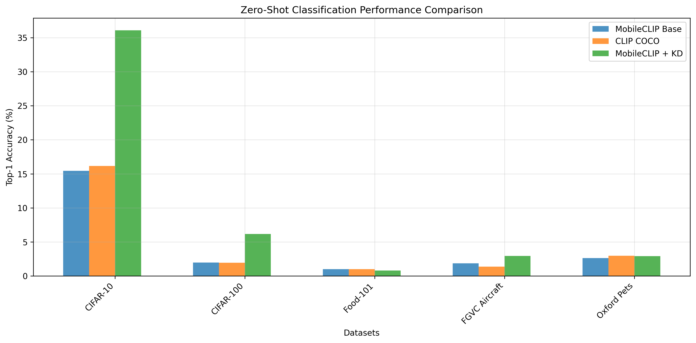

# Mobile CLIP with Knowledge Distillation

A lightweight, efficient framework for visual-textual understanding on resource-constrained platforms, enhanced through knowledge distillation from large-scale CLIP models.

Note: This project is built upon and extends the foundational work by Adityam Ghosh. Original implementation available at: https://github.com/lucifermorningstar1305/qriousAI.git

##  Overview


This project implements Mobile CLIP with Knowledge Distillation, a mobile-optimized version of OpenAI's CLIP model designed for deployment on edge devices and mobile platforms. By combining efficient architectures (MobileNetV3 + Lite Transformers) with a comprehensive knowledge distillation framework, we achieve competitive zero-shot learning performance while maintaining computational efficiency.

### Key Features

- **Efficient Architecture**: MobileNetV3-Large image encoder + Lite Transformer text encoder
- **Knowledge Distillation**: Multi-faceted distillation from pre-trained CLIP models
- **Mobile-Optimized**: 56.8% parameter reduction compared to standard CLIP
- **Zero-Shot Learning**: Strong performance across multiple benchmark datasets

## Performance



*Results show Top-1 accuracy for zero-shot classification*


## 🏗️ Architecture

### Student Model
- **Image Encoder**: MobileNetV3-Large (efficient convolutional architecture)
- **Text Encoder**: Lite Transformer with Long-Short Range Attention (LSRA)
- **Projection Layers**: Cross-modal alignment with residual connections
- **Embedding Dimensions**: 512D or 256D configurations available

### Knowledge Distillation Framework
1. **Feature-Level Distillation**: Alignment of intermediate representations
2. **Response-Level Distillation**: Transfer of similarity matrices and output distributions  
3. **Progressive Training**: Three-phase strategy with automatic loss balancing


## 🚀 Installation

1. **Clone the repository**
```bash
git clone https://github.com/bojuejiadeliba/KLmobile.git
cd mobile-clip-kd
```

2. **Create conda environment**
```bash
conda env create -f qrious_env.yml
```

3. **To train the models run the following command:**

### Base Mobile CLIP Training

```bash
    
python train_coco.py  `
 	--train_data_path /path/to/train.csv  `
 	--val_data_path /path/to/val.csv  `
 	--max_epochs 30  `
 	--data_size 0.1  `
 	--checkpoint_dir /path/to/checkpoints  `
 	--checkpoint_filename "clip_mobile_base"  `
 	--config_path ./configs/config.yaml
```

### Training with Knowledge Distillation


```bash

python train_coco_kd.py `
    --train_data_path /path/to/coco/dataset.csv  `
    --val_data_path /path/to/val.csv `
    --config_path './configs/config.yaml' `
    --auto_kd_config './configs/config_kd.yaml' `
    --max_epochs 30 `
    --data_size 0.3 `
    --checkpoint_dir /path/to/checkpoints `
    --checkpoint_filename mobile_clip_kd `
    --base_checkpoint /path/to/checkpoints/clip_mobile_base.ckpt    
```


4. **To evaluate the models run the following command:**
### Base Mobile CLIP Evaluation

```bash

python evaluate_models.py `
--dataset cifar10 `
--model_checkpoint /path/to/checkpoints/clip_mobile_base.ckpt   `
--config_path './configs/config.yaml'   `
--prompt "a photo of a"   `
--root_dir "./eval_datasets"

```

### Knowledge Distillation Mobile CLIP Evaluation

```bash

python evaluate_models_kd.py  `
--dataset cifar10 `
--model_checkpoint /path/to/checkpoints/clip_mobile_kd.ckpt"   `
--config_path './configs/config.yaml'    `
--prompt "a photo of a"    `
--root_dir "./eval_datasets"  `
--save_results "results/student_cifar10.json"
```


## Methodology

### Knowledge Distillation Framework
- **Teacher Model**: Pre-trained OpenAI CLIP (ViT-B/32)
- **Student Model**: Mobile-optimized architecture
- **Alignment Networks**: Lightweight MLPs with ReLU + Dropout (0.1)
- **Loss Functions**: Combined contrastive + feature + response distillation


---

**Note**: This implementation is designed for research and educational purposes. For production deployment, additional optimization and testing may be required.